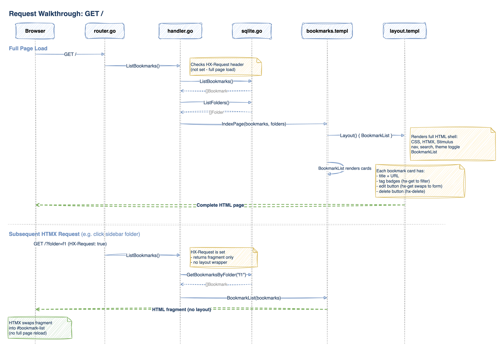

# markd

A bookmark manager built with a server-driven UI stack  - an alternative to JavaScript SPA frameworks.

## Why

In 2026, JavaScript frameworks like React and SvelteKit are the dominant way to build web applications. They're excellent tools with massive ecosystems. But they're not the only way.

A parallel approach has been maturing quietly: server-rendered HTML with lightweight client-side enhancements. Tools like HTMX 4, templ, and Stimulus have reached a point where they offer a genuinely productive development experience - type-safe templates, partial page updates, and structured client-side behavior - without a JavaScript build pipeline at the centre.

markd is an experiment to answer: **how far can this stack go in 2026?** Can it handle the features real applications need - CRUD, search, filtering, folders, dark mode, keyboard shortcuts - while remaining simple to build, test, and deploy? Could it replace a JS framework for the right class of applications?

This project exercises every part of the stack on a real (if small) application to find out.

## The Stack

| Layer | Tool | Role |
| ------- | ------ | ------ |
| Server | **Go + Chi** | Routing, business logic, HTML rendering |
| Templating | **templ** | Type-safe, composable server-side HTML |
| Interactions | **HTMX 4** | HTTP requests, DOM swaps, no client-side router |
| Components | **Basecoat** | UI component library (Tailwind + shadcn-style) |
| Behavior | **Stimulus** | Client-side JS organization (controllers/targets/actions) |
| Styling | **Tailwind CSS v4** | Utility CSS via Basecoat |
| Database | **SQLite** | Embedded, zero-config (via modernc.org/sqlite, pure Go) |

Each tool fills a distinct role without overlap. The server returns HTML fragments for HTMX requests and full pages for direct navigation. No hydration, no virtual DOM, no bundle size anxiety.

## Features

- **Bookmark CRUD** - create, edit inline, delete, all via HTMX partial swaps
- **Folders** - organize bookmarks, sidebar navigation with active state
- **Tags** - comma-separated input, click-to-filter, clear filter
- **Live search** - debounced search-as-you-type (HTMX `hx-trigger="input changed delay:300ms"`)
- **Dark mode** - Basecoat theme toggle with localStorage persistence
- **Keyboard shortcuts** - Ctrl/Cmd+K to focus search (Stimulus controller)
- **Form validation** - server-side validation, 422 responses routed via `hx-status:422`
- **Preload** - HTMX preload extension for near-instant navigation on hover

## How It Works

Every interaction is an HTTP request that returns an HTML fragment:

```
User clicks "Delete" button
  -> HTMX sends DELETE /bookmarks/42
  -> Go handler deletes from SQLite, returns empty 200
  -> HTMX removes the element (outerHTML swap)
```

```
User types in search box
  -> HTMX sends GET /bookmarks/search?q=go (after 300ms debounce)
  -> Go handler queries SQLite, renders templ component to HTML
  -> HTMX swaps the bookmark list with the filtered results
```

No JSON serialization, no client-side state management, no loading spinners. The response IS the UI.

### Request Walkthrough: GET /

Here's what happens when a user opens `http://localhost:3000` for the first time, traced through the actual code:



When the same URL is requested by HTMX (e.g., clicking "All Bookmarks" in the sidebar), the `HX-Request: true` header is set. The handler skips the full page layout and returns just the `BookmarkList` fragment, which HTMX swaps into `#bookmark-list`. Same handler, same data, different response shape.

## Project Structure

```bash
markd/
  cmd/
    server/main.go              # HTTP server entry point
    lambda/main.go              # AWS Lambda entry point
  internal/
    app/router.go               # Shared Chi router (used by both server and lambda)
    handler/
      handler.go                # HTTP handlers (bookmarks, folders, search)
      handler_test.go           # Handler tests
    model/                      # Bookmark, Folder structs
    store/
      store.go                  # Store interface
      sqlite.go                 # SQLite implementation
      sqlite_test.go            # Store tests
      migrations/001_init.sql   # Schema
  components/
    layout.templ                # Base HTML layout (head, nav, scripts)
    bookmarks.templ             # Bookmark list, item, edit form, empty state
    bookmarks_test.go           # Component render tests
    folders.templ               # Folder sidebar
    forms.templ                 # Add bookmark dialog, validation errors
  static/
    css/input.css               # Tailwind + Basecoat imports
    js/
      app.js                    # Stimulus entry point
      controllers/              # Stimulus controllers (shortcuts, dialog)
    vendor/                     # HTMX 4, preload extension (vendored)
  tests/e2e/                    # Playwright E2E tests
  docker/nginx/                 # Optional Nginx config (for non-CDN deployments)
  docs/                         # Stack discussion and design notes
  Dockerfile                    # Multi-stage build (distroless runtime)
  docker-compose.yml            # Single-container local setup
  .golangci.yml                 # Linter configuration
  Makefile                      # All development workflow commands
```

## Prerequisites

- **Go 1.24+** (with GOTOOLCHAIN=auto for newer versions)
- **Node.js 24+** (for Tailwind CSS build and esbuild)
- **templ**  - `go install github.com/a-h/templ/cmd/templ@latest`
- **Air** (optional, for live reload)  - `go install github.com/air-verse/air@latest`
- **golangci-lint** (optional, for linting)  - `go install github.com/golangci/golangci-lint/v2/cmd/golangci-lint@latest`

## Getting Started

```bash
# Clone and install dependencies
git clone https://github.com/ospatil/markd.git
cd markd
npm install

# Build and run
make run
# → markd listening on :3000
```

Open http://localhost:3000.

## Development

```bash
# Start dev mode  - 4 watchers in one terminal
make dev
```

This runs in parallel:

1. **Air**  - watches `.go` files, rebuilds and restarts the server (~200ms)
2. **templ**  - watches `.templ` files, regenerates Go code
3. **Tailwind**  - watches for CSS changes
4. **esbuild**  - watches Stimulus controllers, rebundles JS

Edit a `.templ` file → templ generates Go → Air restarts → refresh browser.

## Testing

```bash
# Go unit tests (store, handlers, components)  - 19 tests
make test

# Verbose
make test-v

# Playwright E2E tests (Stimulus behavior)  - 7 tests
make test-e2e
```

The Go tests demonstrate how easy server-driven UIs are to test:

- **Store tests** - create an in-memory SQLite DB, call methods, assert results
- **Handler tests** - `httptest.NewRecorder`, send a request, check the HTML response. No browser needed.
- **Component tests** - render a templ component to a string, assert it contains the right HTML
- **E2E tests** - Playwright for the 5% that needs a real browser (keyboard shortcuts, dialog behavior, theme toggle)

```go
// Testing a handler is just an HTTP request
func TestFilterByTag(t *testing.T) {
    h, s := setupTestHandler(t)
    s.CreateBookmark(&model.Bookmark{ID: "1", Title: "Go", URL: "https://go.dev", Tags: []string{"go"}})

    req := httptest.NewRequest("GET", "/bookmarks/filter?tag=go", nil)
    w := httptest.NewRecorder()
    h.FilterByTag(w, req)

    body := w.Body.String()
    assert.Contains(t, body, "Go")           // HTML response contains the bookmark
    assert.Contains(t, body, "Filtered by tag") // Shows active filter UI
}
```

## Makefile Reference

| Command | Description |
|---------|-------------|
| **Development** | |
| `make dev` | Start all watchers (server + templ + CSS + JS) |
| `make run` | Build everything and run the server |
| **Quality** | |
| `make test` | Run Go tests (19 tests) |
| `make test-e2e` | Run Playwright E2E tests (7 tests) |
| `make lint` | Run Go linter (golangci-lint) |
| `make fmt` | Format Go code |
| **Docker** | |
| `make docker-up` | Build images and start Docker container |
| `make docker-down` | Stop Docker container |
| `make docker-logs` | Tail Docker logs |
| `make docker-build-direct` | Build Docker image (use if Go module proxy is blocked) |
| **Deployment** | |
| `make build-lambda` | Build Lambda binary (arm64 Linux) |
| **Low-level** (called by other targets) | |
| `make docker-build` | Build Docker images without starting |
| `make build` | Build the server binary |
| `make generate` | Generate templ Go code |
| `make css` | Build Tailwind CSS |
| `make js` | Bundle Stimulus controllers |
| `make clean` | Remove build artifacts |
| `make help` | Show all available commands |

## Deployment

### Docker

```bash
make docker-up
# → http://localhost:3000
```

The Docker image uses a multi-stage build: `golang:alpine` for building, `distroless/static` for runtime (~15MB final image). SQLite data persists on a named volume.

For environments where the Go module proxy is blocked:

```bash
make docker-build-direct
```

### AWS Lambda

The same Chi router runs on Lambda via `aws-lambda-go-api-proxy`:

```bash
make build-lambda
# → bin/bootstrap (12MB arm64 binary for provided.al2023 runtime)
```

Architecture with Lambda:

```
CloudFront
  /static/*  → S3 bucket
  /*         → API Gateway HTTP API → Lambda (Go)
```

### Nginx (Optional)

For deployments without a CDN, an Nginx config is provided in `docker/nginx/` that handles static asset caching (1-year immutable headers), gzip compression, and reverse proxying to the Go app. With a CDN in front, Nginx is unnecessary  - the Go app serves static files directly.

## Stack Discussion

For the discussion on stack choices, tradeoffs, and comparisons with SvelteKit/Next.js/Hotwire, see [docs/server-driven-ui-stack.md](docs/server-driven-ui-stack.md).
